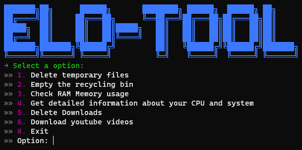

# Elo-Tool

Elo-Tool is a repository that provides tools to help you optimize your workspace and obtain information about your PC. The repository is designed to be easy to use, and the tools are accessible from a single command-line interface. To use the tools, you'll need to download Python and the required libraries, which can be done using the instructions provided in the repository.

## Recent Features:
- Delete temporary files.
- Empty the recycling bin.
- Check RAM Memory usage.
- Get detailed information about your CPU and system.
- Quickly empty the Downloads folder.
- Download youtube videos.



## Requirements

To run the `main.py` script in your terminal, you'll need to download Python and its pip package management system.

You'll also need to download the required libraries. To download them, run `pip install -r requirements.txt` in your terminal. The following libraries will be downloaded:

| Libraries | How to install each particular library |
| -- | -- |
| Colorama | `pip install colorama` |
| Psutil | `pip install psutil` |
| Keyboard | `pip install keyboard` |
| Pytube | `pip install pytube` |

## Run

To run the project, clone the repository by typing the following in your terminal:
~~~
git clone https://github.com/dev-eloy/elo-tools.git
~~~

Open the Command Prompt, navigate to the project folder, and run python `main.py`.


## 📁 Folder structure

```
📂elo-tool
 ┣ 📂assets
 ┃ ┗📷readme.png
 ┣ 📂scripts
 ┃ ┣ 📜downloads.py
 ┃ ┣ 📜ram.py
 ┃ ┣ 📜recycle.bin.py
 ┃ ┣ 📜system.py
 ┃ ┣ 📜temp.py
 ┃ ┣ 📜youtube.py
 ┣ 📜README.md
 ┣ 📜main.py
 ┣ 📜requirements.txt
```


